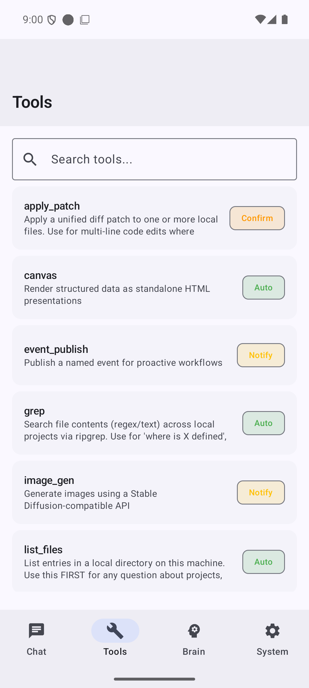
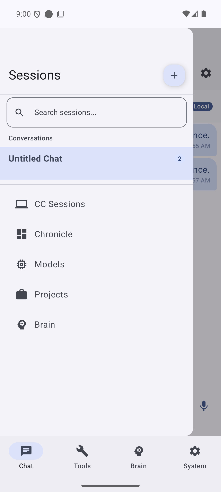
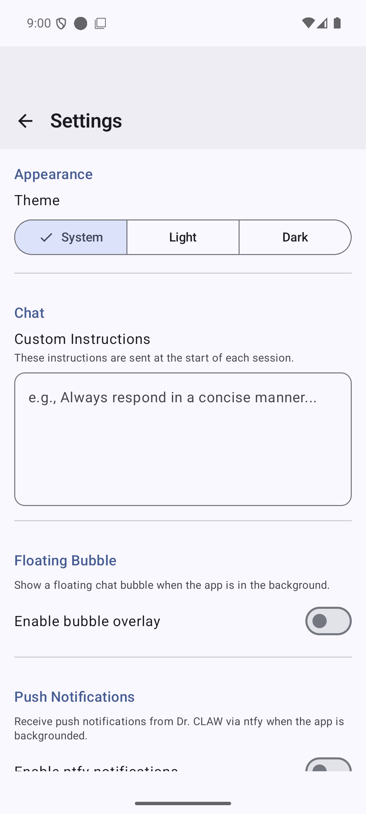

# Dr. CLAW

[](https://github.com/scaso01/dr-claw-app/actions/workflows/ci.yml)
[](LICENSE)
[](https://kotlinlang.org)
[](https://developer.android.com)

A native Android client for the [Ironjaw](https://github.com/scaso01/ironjaw)
gateway. It gives you a phone-shaped front end for an assistant running on your
own hardware, with no third-party service in the path and no account to sign in
to.

Everything goes over one authenticated WebSocket to a gateway you control. Point
it at a machine on your LAN, a VPN address, or a hostname behind your own reverse
proxy, and that is the entire backend.

<p align="center">
  
  
  
</p>

## Why it exists

Putting a chat UI on a self-hosted model usually means either a web page that
forgets everything on refresh, or a Telegram bot, which routes your conversations
through somebody else's servers to get a decent mobile experience.

This is the third option. It behaves like the messaging apps it borrows from,
streaming replies, swipe to reply, share sheet, notifications, offline history,
while the transport stays a single socket to your own gateway.

The design constraint throughout is that the phone is a bad place to lose state.
History lives in an encrypted Room database, so the app opens instantly and stays
readable with the gateway unreachable. A dropped connection reconnects and picks
up the stream rather than restarting it.

## Features

**Chat.** Live streaming with the message editing as tokens arrive, Markdown
rendering with copyable code blocks, inline suggestion chips, slash commands, long
press for copy, share, reply, regenerate and delete, and swipe to reply threading.

**Input.** Photo and file attachments, camera capture, voice input through Android
speech recognition, which works offline, and a full screen voice conversation mode.

**Sessions.** Create, rename, fork, pin, archive and delete. Full text search
across all history via SQLite FTS. Everything is stored locally and encrypted.

**Agentic tools.** When the gateway runs a tool the app renders a tool card with
live progress, and permission prompts surface as approve or deny dialogs rather
than silently failing.

**System control.** Optional screens for the gateway's own subsystems: memory
browser with an approval queue, infrastructure and device status, scheduled jobs,
model management, a secrets vault and a session archive.

**Background.** A foreground service keeps the socket alive with automatic
reconnect and fast recovery on network change, plus notification channels and an
Android 11+ floating bubble.

**Coding agent sessions.** List, attach to and create Claude Code sessions across
machines, with a split view. This talks to the optional `cc-bridge` daemon, see
below.

## Requirements

- Android 7.0 (API 24) or newer
- JDK 21 and Android SDK 36 to build
- A running [Ironjaw](https://github.com/scaso01/ironjaw) gateway and its auth token

## Quick start

```bash
git clone https://github.com/scaso01/dr-claw-app.git
cd dr-claw-app
cp secrets.properties.example secrets.properties
```

Edit `secrets.properties` with your gateway address and token. `secrets.properties`
is gitignored and its values are compiled into `BuildConfig`, so nothing is read
from the filesystem at runtime:

```properties
GATEWAY_URL=wss://gateway.example.com
GATEWAY_TOKEN=the-token-your-gateway-is-configured-with
```

Building from the command line rather than Android Studio also needs Gradle
pointed at your SDK, either through `ANDROID_HOME` or through a `sdk.dir` line in
`local.properties`, which is gitignored. Android Studio writes that file for you
on first open, so this step only applies to a plain terminal build:

```bash
export ANDROID_HOME="$HOME/Android/Sdk"          # macOS and Linux
setx ANDROID_HOME "%LOCALAPPDATA%\Android\Sdk"   # Windows
```

Then build and install:

```bash
./gradlew assembleDebug     # APK in app/build/outputs/apk/debug/
./gradlew installDebug      # build and push to a connected device
```

The gateway URL can also be changed at runtime from the Settings screen, which is
usually easier than rebuilding when you are moving between networks.

## Configuration

Everything in `secrets.properties` beyond the first two keys is optional.

| Key | Purpose |
|---|---|
| `GATEWAY_URL` | WebSocket URL of your Ironjaw gateway, `ws://` or `wss://` |
| `GATEWAY_TOKEN` | Bearer token the gateway expects |
| `CC_BRIDGE_URL` | Direct WebSocket to a `cc-bridge` daemon. Blank routes coding-agent calls through the gateway instead |
| `PHONE_CC_BRIDGE_URL` | A `cc-bridge` running on the phone itself, under Termux |
| `PHONE_CC_BRIDGE_TOKEN` | That daemon's own token, which is not the gateway token |
| `MESHNET_IP` | Pins the gateway hostname to a fixed address, skipping DNS on a VPN path |
| `UI_BRIDGE_SECRET` | Shared secret gating the accessibility bridge that lets the assistant drive other apps |

TLS is whatever your reverse proxy presents. The app does not pin certificates, so
a normal publicly trusted certificate works with no extra configuration.

## How it connects

The app speaks Ironjaw's Protocol v4 over a single WebSocket.

| Method | Purpose |
|---|---|
| `chat.send`, `chat.send.multimodal` | Send text or text plus attachments |
| `chat.history` | Load a session's messages |
| `chat.abort` | Stop an in-flight run |
| `chat.inject` | Insert an assistant note without a model call |
| `sessions.list`, `sessions.patch`, `sessions.delete`, `sessions.reset` | Session management. Session context is per request via `sessionKey`, there is no switch call |
| `talk.mode`, `tts.convert` | Voice conversation pipeline |
| `brain.*`, `vault.*`, `model.*`, `gateway.restart` | Feature RPCs backing the system screens |

Streaming arrives as `chat` events, which is what produces the live typing effect.
The full method registry lives in the [Ironjaw protocol
reference](https://github.com/scaso01/ironjaw/blob/main/docs/protocol-v4.md).

## Project layout

Single activity Compose app.

| Path | Contents |
|---|---|
| `app/src/main/java/.../ui/` | One package per screen, plus shared `components/` |
| `app/src/main/java/.../data/` | Transport clients, Room database, one repository per feature |
| `app/src/main/java/.../service/` | Foreground service, bubble, network monitor, accessibility bridge |
| `app/src/main/java/.../cmd/` | Incoming phone commands, each behind an approval gate |
| `cc-bridge/` | Optional Node daemon that owns Claude Code sessions, see its own README |
| `phone-setup/` | Notes for running the bridge on the phone under Termux |

## Testing

```bash
./gradlew test                    # JVM unit tests
./gradlew connectedDebugAndroidTest   # instrumented, needs a device or emulator
```

There is also a UI suite driven by uiautomator2 against a running app:

```bash
pip install uiautomator2 pytest
./app/src/test/e2e/run_e2e.sh
```

## Built with

Kotlin 2.3.0, Jetpack Compose with Material 3, OkHttp for the WebSocket, Hilt for
injection, Room 2.7.1 for local storage, and Compose Navigation. Architecture is
MVVM over a clean-architecture split, and the `data/` layer avoids Android imports
so it can be lifted into a multiplatform module.

## License

GPL-3.0-or-later. See [LICENSE](LICENSE).

Bundled third-party components and their licences are listed in
[THIRD_PARTY_NOTICES.md](THIRD_PARTY_NOTICES.md).
